# Dual-Cloud Kubernetes Platform — AWS EKS &amp; Azure AKS

A scalable, cloud-native Python web application deployed independently on **both** Amazon EKS and Azure AKS — containerized with Docker, backed by managed PostgreSQL, exposed through public Ingress controllers, and provisioned end-to-end with Terraform.

This isn't a copy-paste tutorial project. Both cloud accounts had real, undocumented restrictions (instance-type limits, quota walls, region-specific service availability) that had to be diagnosed and worked around live. Every command, file, and error below is from the actual build — see [`index.html`](./index.html) for the full step-by-step log with every manifest and script included.

**Live write-up:** [GitHub Pages walkthrough](https://elixirman.github.io/CloudMirror-EKS-AKS/) — toggle between the full AWS and Azure build logs, including every file and every fix.

---

## The brief

Design and deploy a scalable, cloud-native Python web application with a dual-cloud architecture targeting both AWS and Microsoft Azure. Docker containers orchestrated on Kubernetes (EKS / AKS), managed persistent data via PostgreSQL, and secure public routing via Ingress Controllers — with the entire multi-cloud infrastructure provisioned and replicated using Terraform.

Each cloud runs its **own independent stack** — same app image, same schema, own database, own Ingress, own public URL. No cross-cloud data replication; this is an active/active pair of identical deployments, not a single logical database split across providers.

## Architecture

```
AWS                                    Azure
───────────────────────────────        ───────────────────────────────
VPC (10.0.0.0/16)                      Resource group (ogplatform-rg)
 ├─ public + private subnets, NAT       ├─ VNet (10.1.0.0/16) + subnet
 ├─ EKS cluster (ogplatform-eks)        ├─ AKS cluster (ogplatform-aks)
 │   └─ 3× t3.micro nodes               │   └─ 2× Standard_D2s_v7 nodes
 ├─ RDS PostgreSQL 16.9                 ├─ PostgreSQL Flexible Server 16
 ├─ ECR (ogplatform-app:v1)             ├─ ACR (ogplatform-app:v1)
 └─ ALB via aws-load-balancer-          └─ NGINX Ingress → public IP
     -controller → public URL
```

## Stack

Python (FastAPI) · Docker · Kubernetes (EKS + AKS) · Terraform · PostgreSQL (RDS + Flexible Server) · AWS Load Balancer Controller · NGINX Ingress · Helm · eksctl

## Repo structure

```
.
├── app/                  # FastAPI app, Dockerfile, seed script (cloud-agnostic)
├── k8s/
│   ├── aws/               # namespace, secret, deployment, service, ingress
│   └── azure/             # namespace, secret, deployment, service, ingress
├── aws/                   # Terraform root: VPC, EKS, RDS, backend
├── azure/                 # Terraform root: VNet, AKS, Postgres, backend
├── docker-compose.yml      # local test stack (app + Postgres)
├── docs/screenshots/
│   ├── aws/
│   └── azure/
├── index.html              # full build log with every file + command
└── README.md
```

---

## Local proof of concept

Before touching any cloud resource, the app was built and verified locally with Docker Compose — FastAPI + Postgres, seeded with 20 sample oil &amp; gas sensor readings (pressure, temperature, flow rate, vibration), served through a styled dashboard.

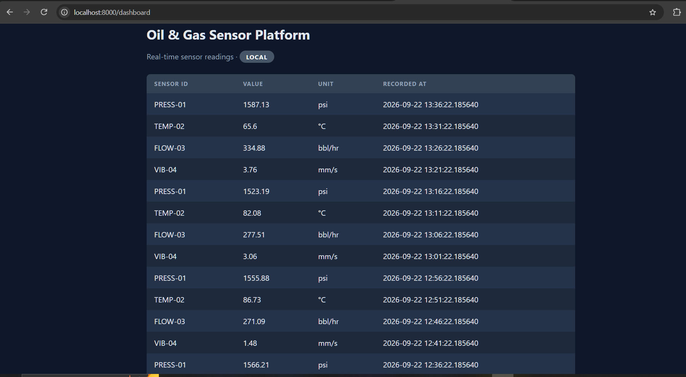
*The dashboard running locally, before any cloud infrastructure existed — confirming the app, database schema, and seed data all worked end to end.*

---

## AWS build

**Stack:** VPC → EKS → RDS PostgreSQL → ECR → Kubernetes manifests → AWS Load Balancer Controller → public ALB

### Cluster and networking

```bash
aws eks update-kubeconfig --region eu-west-1 --name ogplatform-eks
kubectl get nodes
```

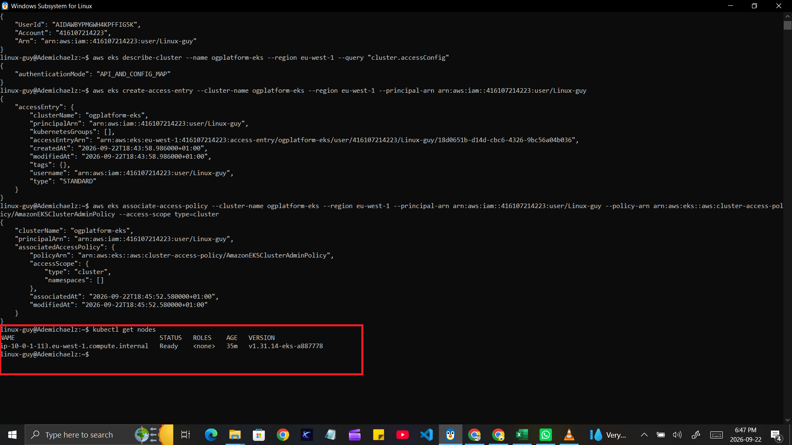
*EKS node confirmed `Ready` after resolving an AWS CLI v1/v2 mismatch and adding an EKS access entry for cluster admin.*

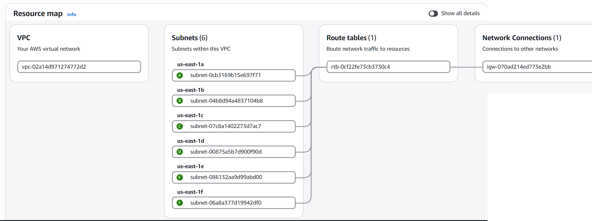
*The VPC Terraform created — public/private subnets across two AZs, single NAT gateway to control cost.*

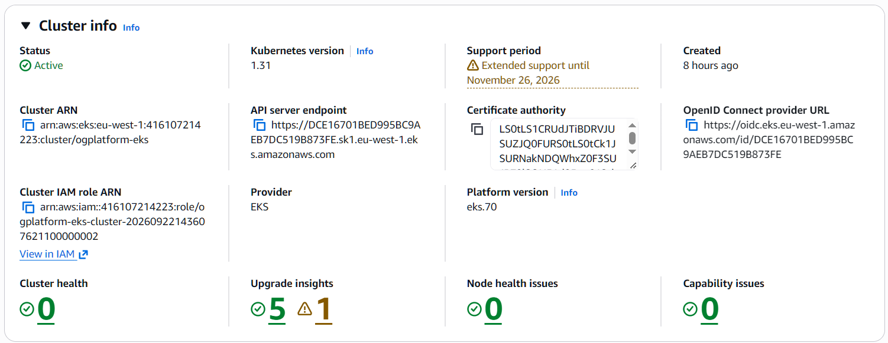
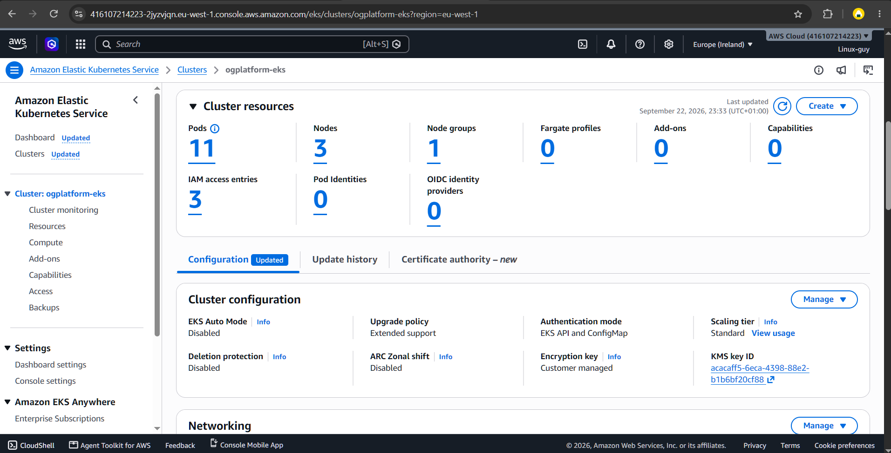
*EKS cluster overview in the AWS Console — confirmed control plane, compute, and add-ons.*

### Database

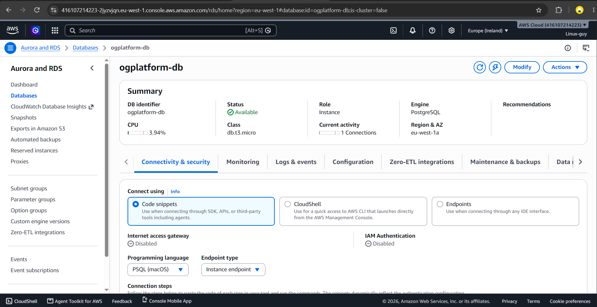
*RDS PostgreSQL 16.9, `db.t3.micro`, private subnet, reachable only from the EKS node security group.*

### Application deployment

```bash
kubectl port-forward -n ogplatform svc/ogplatform-service 8080:80
curl http://localhost:8080/health
```

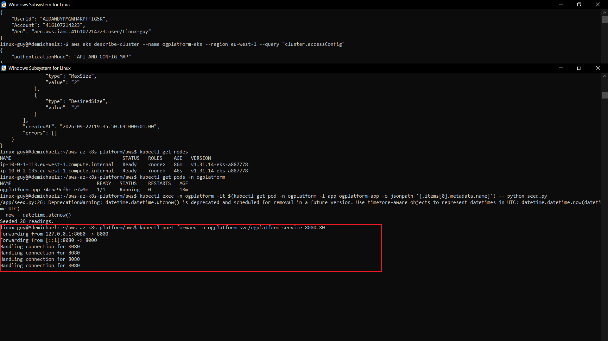
*Verifying the app responds correctly before exposing it publicly through Ingress.*

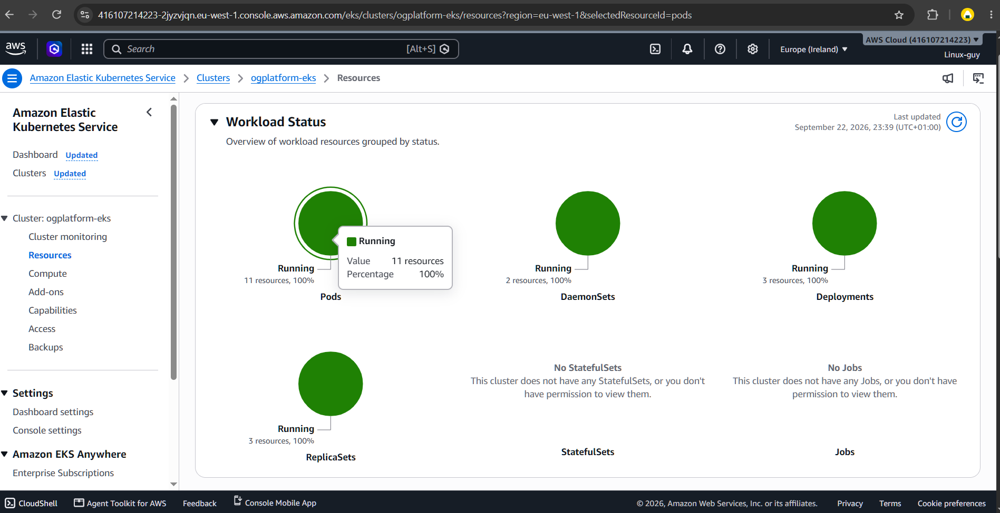
*The app pod `Running` and `1/1` ready — after resolving a "too many pods" scheduling wall by scaling the node group from 1 → 3 `t3.micro` nodes.*


*The `/readings` endpoint returning live rows from RDS after seeding.*

### Public routing

```bash
kubectl get ingress -n ogplatform
curl http://<alb-hostname>/health
```

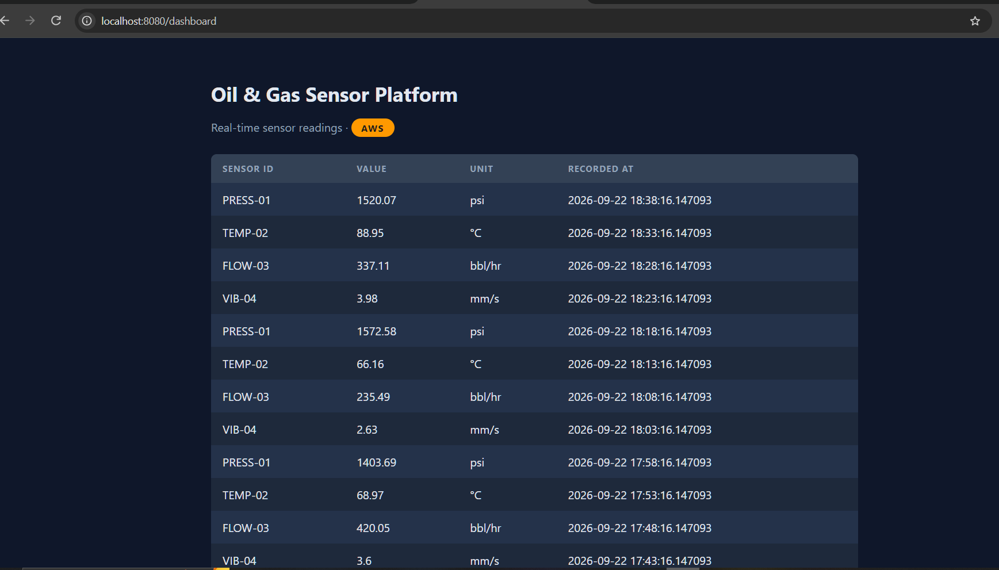
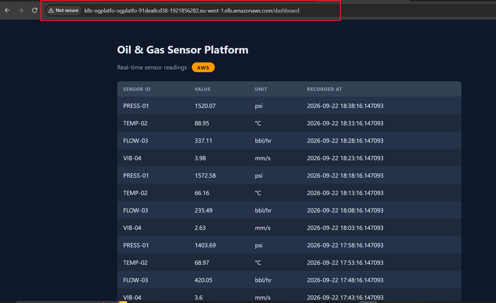
*The dashboard, publicly reachable through a real AWS Application Load Balancer — no VPN, no port-forwarding, just the public internet.*

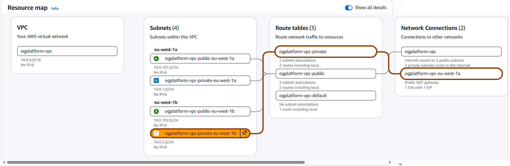
*Full resource map — VPC, EKS, RDS, and the ALB all visible together in the AWS Console.*

### What broke on AWS

- **EKS AMI mismatch** — Kubernetes 1.30's default AMI wasn't supported in this region → bumped to 1.31.
- **Free-tier instance restriction** — `t3.medium` node group rejected: *"not eligible for Free Tier."* Switched to `t3.micro`.
- **Power loss mid-apply, twice** — Terraform's saved plan went stale; regenerated and re-applied without issue since state itself wasn't corrupted.
- **AWS CLI v1/v2 conflict** — kubectl 1.36 rejected the auth API AWS CLI v1 generated. Removed the old `awscli` package, installed CLI v2 cleanly.
- **EKS access entries** — a valid IAM identity still got *"the server has asked for the client to provide credentials"* because newer EKS clusters require explicit API-based access entries, not just the legacy `aws-auth` ConfigMap.
- **Pod-scheduling wall, twice** — `t3.micro` nodes support very few pods once system daemonsets are counted; scaled 1 → 2 → 3 nodes as the app pod and then the Load Balancer Controller's pods landed.
- **Terraform ignores `desired_size` post-creation** — had to scale the node group directly via the AWS CLI; Terraform's EKS module assumes an autoscaler owns that value.

---

## Azure build

**Stack:** VNet → AKS → PostgreSQL Flexible Server → ACR → Kubernetes manifests → NGINX Ingress → public IP

### Cluster and networking

```bash
az aks get-credentials --resource-group ogplatform-rg --name ogplatform-aks
kubectl get nodes
```

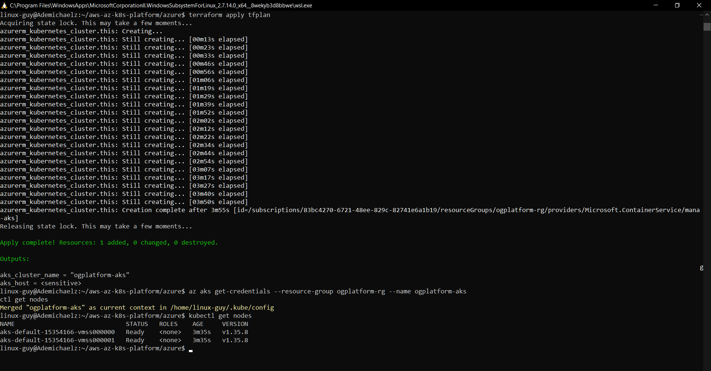
*Two AKS nodes and the app pod, confirmed active — no auth friction here, unlike the AWS side.*

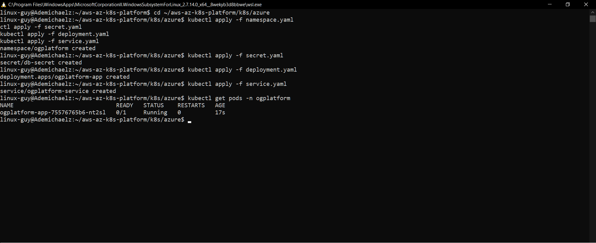
*The app pod `Running` and ready on AKS.*

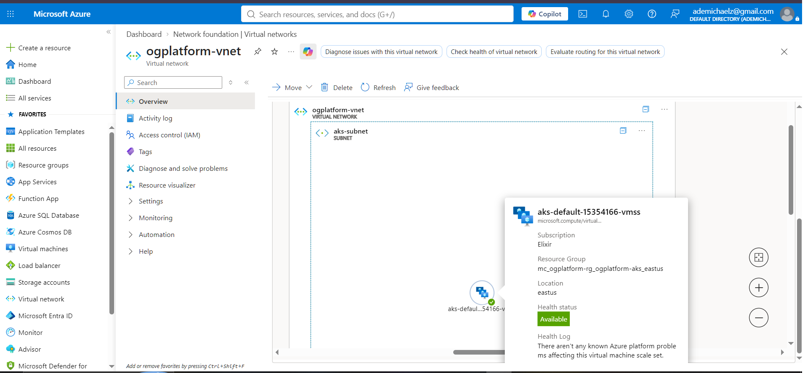
*AKS topology view in the Azure Console — nodes, pods, and services in relation to each other.*

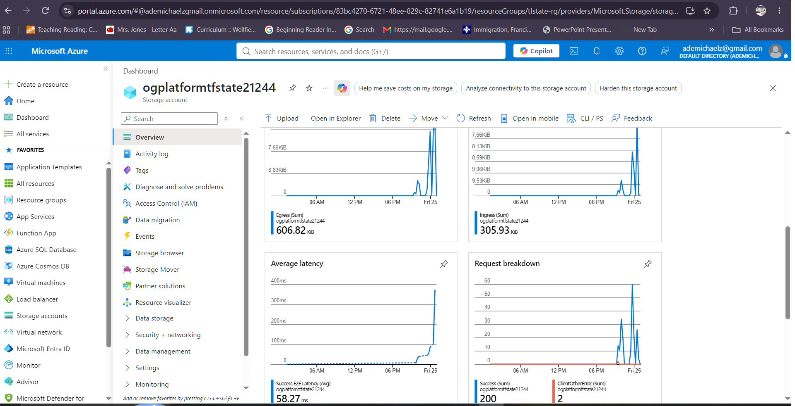
*Cluster metrics confirming healthy CPU/memory usage on the `Standard_D2s_v7` node pool.*

### Image build and push

```bash
az acr build ... # or docker build + docker push, see index.html for exact commands
```


*The app image built and pushed to Azure Container Registry (ACR).*

### Public routing

```bash
kubectl get service --namespace ingress-nginx ingress-nginx-controller
curl http://<external-ip>/health
```

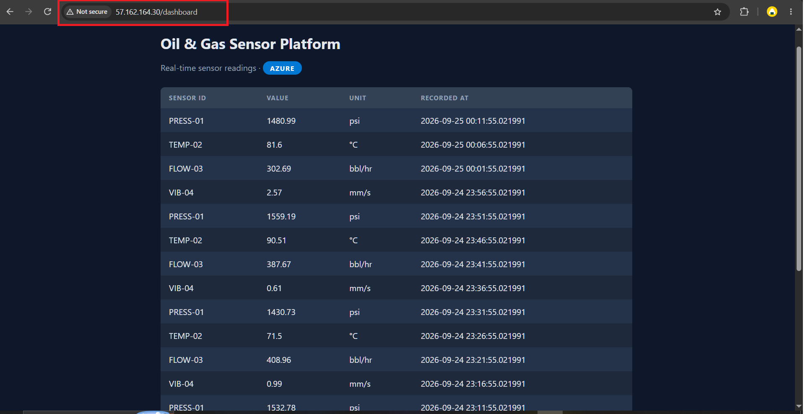

*The dashboard, publicly reachable through the Azure Load Balancer provisioned by the NGINX Ingress controller — blue Azure badge confirming which cloud it's serving from.*

### What broke on Azure

- **VM size not allowed** — `Standard_B2s` rejected in `northeurope`: *"not allowed in your subscription in this location."* The allowed-VM-size list for that region was almost entirely huge/GPU/confidential-compute SKUs.
- **Zero vCPU quota** — even allowed B-series v2 sizes had zero quota. Had to cross-check allowed sizes against real quota across multiple regions before finding a working combination (`Standard_D2s_v7` in `eastus`).
- **PostgreSQL Flexible Server region restriction** — blocked in `eastus` entirely (*"Provisioning is restricted in this region"*), independent of the VM-size issue. Placed the database in `westus2` while keeping AKS in `eastus` — a deliberate cross-region trade-off, not a production pattern.
- **AKS OIDC issuer conflict** — a later `terraform apply` failed with `OIDCIssuerFeatureCannotBeDisabled` since AKS had auto-enabled the OIDC issuer; fixed by explicitly setting `oidc_issuer_enabled = true`.
- **Manual ACR blocked `terraform destroy`** — the ACR was created outside Terraform's state (`az acr create` directly), so it silently blocked resource-group deletion until removed manually.

---

## Teardown

Both clouds were fully torn down after screenshots were captured, to avoid ongoing cost. Verified clean on each side:

```bash
# AWS
aws eks list-clusters --region eu-west-1
aws rds describe-db-instances --region eu-west-1
aws elbv2 describe-load-balancers --region eu-west-1

# Azure
az group exists --name ogplatform-rg
az aks list --output table
az postgres flexible-server list --output table
```

All returned empty/false. Only the Terraform remote-state backends (S3 + DynamoDB on AWS, Storage Account on Azure) were kept, so either side can be rebuilt from Terraform without starting over.

## Lessons

- **Cloud accounts aren't uniform.** Free-tier and quota restrictions vary by subscription and aren't always documented anywhere obvious — the only reliable approach is querying the account's real capabilities and reading the actual error, not assuming a "standard" size will work.
- **Region availability is per-service, not per-cloud.** A service being available in a region says nothing about whether every dependent service is.
- **Small nodes hit pod-count ceilings fast**, especially once a load balancer controller or other system add-on is added.
- **Infrastructure-as-code only manages what's in its state.** Anything created by hand alongside Terraform has to be tracked and torn down manually, or it'll block a clean destroy.

---

*Built as a hands-on Cloud Engineering portfolio project, targeting the Oil &amp; Gas sector.*
